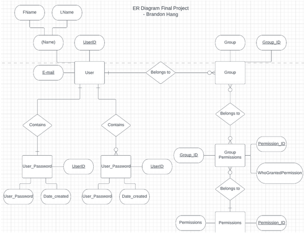

# User Authentication Database SQL

In my database class, I have created a very simple user authentication database in SQL. This database will be utilized as a way to not only hold users' passwords but to identify what group they belong to and keep track of the number of attempts in logging in.

### Background

In order to maintain user authentication and password, it is important to identify who belongs to what group in order to determine the number of permissions they have. Resources within the organization should have some form of restricted access, this way the necessary people are able to perform a certain task without the need of having access to more sensitive tools.

#### Entity Relationship diagram:

  

## Queries:

The [six_queries](six_queries.sql) file contains some sample queries that can be used against the database.

### Notes:

Again this is a very simple database for a user authentication. Typically passwords should be hashed and then stored in the database. This project was meant for a clear demonstration of how databases are created and the importance of queries with different conditions.
